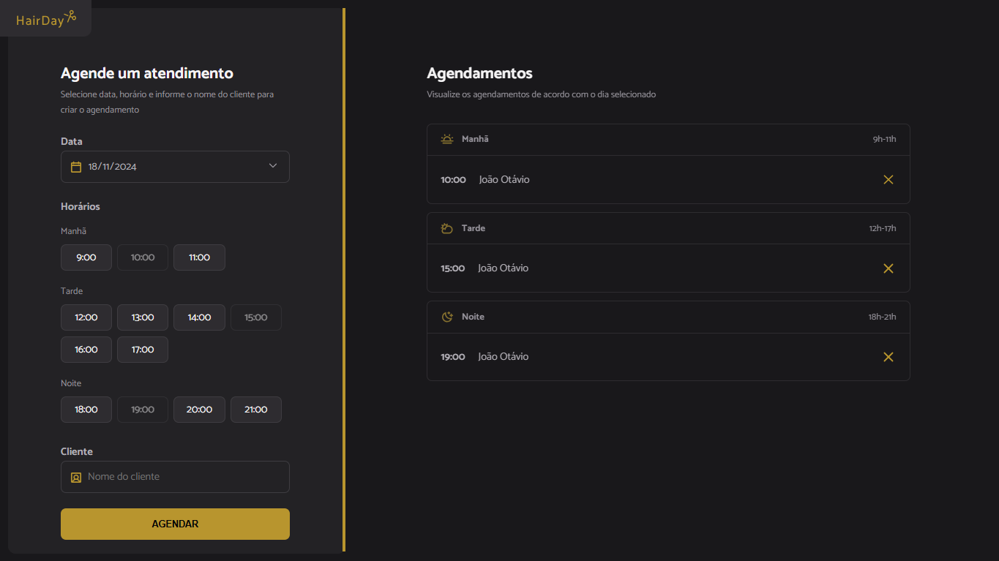

# ✂️ HairDay 🪮

**HairDay** é uma aplicação web desenvolvida para facilitar o agendamento de cortes de cabelo. ✂️ Pensada com foco nos profissionais da área, a ferramenta permite escolher datas e horários disponíveis para organizar os compromissos de maneira eficiente. 📅



## 📋 Funcionalidades

- 🗓️ Seleção de datas e horários disponíveis.
- 📌 Agendamento prático para profissionais organizarem seus compromissos.
- 🖥️ Interface simples e intuitiva para uso no dia a dia.

## 🛠️ Tecnologias Utilizadas

- 🟨 **JavaScript**: Linguagem principal da aplicação.
- 🌐 **HTML**: Estruturação da página.
- 🎨 **CSS**: Estilização e design visual.
- 📦 **Webpack**: Gerenciamento de módulos e otimização.
- 🔄 **Babel**: Transpilação para compatibilidade com navegadores.
- 🕒 **Day.js**: Manipulação e formatação de datas e horários.

## 📦 Instalação e Uso

1. 🖥️ Clone o repositório:

```bash
git clone
``` 

2. 📂 Navegue até o diretório do projeto:

```bash
cd hairday
``` 

3. 📥 Instale as dependências:

```bash
npm install
``` 

4. 🌐 Inicie o servidor de desenvolvimento:

```bash
npm run server
``` 

5. 🚀 Para iniciar a aplicação:

```bash
npm run dev
``` 

6. 🔗 A aplicação estará disponível em: [http://localhost:3000](http://localhost:3000)

## 🤝 Contribuindo

Se você deseja contribuir com o projeto, fique à vontade para abrir uma pull request ou uma issue.

## 📞 Contato

<div>
    <a href="https://www.linkedin.com/in/joschonarth/" target="_blank"></a>
    <a href="mailto:joschonarth@gmail.com" target="_blank"></a>
</div>